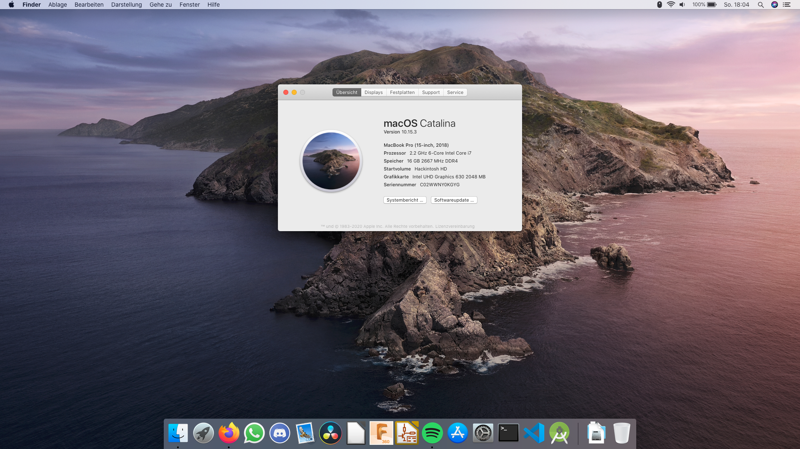

# Dell XPS 15 9570 Catalina
A collection of all resources needed to run macOS Catalina on a Dell XPS 15 9570

## Overview
This is more of a compilation of information and configs from various repositories and forums than a place where real development happens. This repository should contain everything needed to get Catalina up and running on your specific Dell XPS 9570 configuration.

### Currently not working
- Discrete GPU (Nvidia)
- Fingerprint Reader
- SD Reader
- Stock Killer Wi-Fi (easily replaced)
- (Thunderbolt) not tested

## Installation
Follow this guide if you have never set up a Hackintosh before.

### Creating a bootable installer
To start you need a USB flash drive with at least 12GB of available storage and a local copy of macOS. The installer for macOS Catalina can be obtained from [here](https://itunes.apple.com/de/app/macos-catalina/id1466841314?ls=1&mt=12).

Next, you want to format the USB flash drive using Disk Utility. Click on “View” in the toolbar and choose “Show All Devices” to see all physical disks instead of only partitions. Select your USB flash drive, name it “MyVolume” and format it HFS+/Mac OS Extended (Journaled) with GUID Partition Map.

Now you are ready to create the installation media. Use the following command to start the process. It may take a while depending on the USB flash drive you are using.

```sudo /Applications/Install\ macOS\ Catalina.app/Contents/Resources/createinstallmedia --volume /Volumes/MyVolume```

If your USB flash drive has a different name, replace ```MyVolume``` with the name of your volume.

After the installer says that it's done, the volume now contains the macOS Catalina installer and is ready to boot on a real Mac. However, because we are building a Hackintosh, we have to take an additional step and install the OpenCore bootloader. To do this, you first have to mount the EFI partition. This is where OpenCore and all its configuration files go. Use the following command to list all disks.

```sudo diskutil list```

Find the EFI partition of your USB flash drive. Normally its entry 1 under /dev/disk2. Use the following command to mount the EFI partition - in this case, ```disk2s1```.

```sudo diskutil mount disk2s1```

Now that you have access to the EFI partition, the real fun starts.

### Configuring EFI
Clone this repository to get the base EFI folder as well as all additional kexts and patches. Now you will have to prepare the EFI folder for your exact hardware configuration. Read through the [configuration section](#configuration) to learn more. Once everything is configured properly, copy the folder into the EFI partition you have mounted in the previous step.

### Booting the installer
After having created the installer USB flash drive, you are ready to install macOS on your XPS. Make sure SSD mode is set to AHCI mode instead of RAID in BIOS otherwise, macOS won't be able to detect your SSD. Select your USB flash drive as boot media and go through the macOS installer like you would on a real mac. Once you have come to the desktop, advance to the next step.

### Post Installation
Congratulations! You have successfully booted and installed macOS. At this point, you just have to copy the EFI folder you have prepared in a previous step to the SSD. Mount the EFI partition of your SSD with

```sudo diskutil mount disk0s1```

and copy your customized EFI folder into the newly mounted EFI partition. You should now be able to boot your computer without the USB flash drive attached. If you're having issues with specific parts like Wi-Fi, Bluetooth or Audio, have a look at the corresponding sections in this repository and open an issue if you are unable to solve them.

## Configuration
This section talks about configuring the EFI folder for your exact hardware.

Almost all changes are done inside the OpenCore configuration file. Use the provided version of [ProperTree](https://github.com/corpnewt/ProperTree) to edit ```EFI/OC/config.plist```.

### Audio
By default, the audio can be a bit buggy. When using headphones, after some time the audio randomly stops. Sometimes un- and replugging the headphones works, but that's pretty annoying and unreliable. To permanently fix this issue you will have to install [ComboJack](https://github.com/hackintosh-stuff/ComboJack/tree/master/ComboJack_Installer) from the ```tools``` folder by running ```install.sh```.

### Wi-Fi/Bluetooth
The stock Killer Wi-Fi card will never be supported in macOS. So to use Wi-Fi, you will have to replace it for a supported card. This repository is configured to work out-of-the-box with both the Dell DW1830 and DW1560 wireless adapter.

Another option for a fraction of the price is the [Dell DW1820a](https://www.aliexpress.com/item/32918457901.html). It is a bit slower than the cards mentioned above and in my experience has problems with some 5GHz networks, but with a minor modification, you can make it work pretty reliably. The only change that has to be done is disabling “Active State Power Management”. This can be done by inserting the following entry under ```Root/DeviceProperties/Add```.

```xml
<key>PciRoot(0x0)/Pci(0x1c,0x0)/Pci(0x0,0x0)</key>
<dict>
    <key>pci-aspm-default</key>
    <integer>0</integer>
</dict>
```

### Display
This repository is configured to work properly with the 4K display. If you have a FHD screen, you should apply two minor changes:

- Change ```dpcd-max-link-rate``` in ```Root/DeviceProperties/Add/PciRoot(0x0)/Pci(0x2,0x0)``` from ```14000000``` to ```0A000000```
- Change ```UIScale``` in ```Root/NVRAM/Add/4D1EDE05-38C7-4A6A-9CC6-4BCCA8B38C14``` from ```02``` to ```01```

Also, I strongly suggest enabling subpixel antialiasing for the FHD screen.

```defaults write -g CGFontRenderingFontSmoothingDisabled -bool NO```

### Power management
Hibernation is not supported on a Hackintosh and everything related to it should be completely disabled. Disabling additional features prevents random wakeups while the lid is closed. After every update, these settings should be reapplied manually.

```
sudo pmset -a hibernatemode 0
sudo rm -f /var/vm/sleepimage
sudo mkdir /var/vm/sleepimage
sudo pmset -a standby 0
sudo pmset -a autopoweroff 0
sudo pmset -a powernap 0
sudo pmset -a proximitywake 0
sudo pmset -b tcpkeepalive 0 (optional)
```

### Performance
CPU power management is done by ```CPUFriend.kext``` while ```CPUFriendDataProvider.kext``` defines how it should be done. ```CPUFriendDataProvider.kext``` is generated for a specific CPU and power setting. The one supplied in this repository was made for the i7-8750H and is optimized for maximum performance. In case you have another CPU or would rather sacrifice some performance in trade for more battery life, you can use the script [one-key-cpufriend](https://github.com/stevezhengshiqi/one-key-cpufriend) from the ```tools``` folder to generate your own ```CPUFriendDataProvider.kext```.

### Touchscreen
If you don't need the touchscreen you can disable it to save power. Replace ```SSDT-TPDX.aml``` in ```EFI/OC/ACPI``` with the one inside the ```resources``` folder.

### iMessage and AppStore
NOTE: With the killer wifi card, iMessage is not working, even with this fix. Swap to a Broadcom card to make it work.
To get iMessage and other Apple services working properly you need to change a few settings in your config.plist:
+ Serial Number
+ Board Number
+ SmUUID
To get them you can generate from (Hackintool)[https://www.tonymacx86.com/threads/release-hackintool-v3-x-x.254559/] , remember that our SMBIOS is MacBookPro15,1. Before adding them to our config.plist , we need to check the serial. 
First of all we'll go on (this)[https://everymac.com/ultimate-mac-lookup/] website and we'll prompt our serial. If it displays correctly our Mac model, we can go on checking the same serial on (Apple's website)[https://checkcoverage.apple.com] . Now pay attention: if Apple's website says that *SERIAL ISN'T VALID* that is good , we can use that serial. If it says it's a valid one, we gonna need to generate another serial and of course another board number, that changes according to the serial. 
Once we've got all the things, we can open our config.plist with ProperTree and edit Root/PlatformInfo/Generic/
+ Serial Number -> SystemSerialNumber
+ Board Number -> MLB
+ SmUUID -> SystemUUID

Reboot and things should work. 

## Frequently asked questions

### Why my trackpad doesn't work?
You pressed the "Stamp" button (right of F12) that instead of enabling/disabling wifi as it says, it enables/disables the trackpad. Good to know

### I have a Samsung PM981 SSD, will it work?
Currently under testing, but with a fix seems to work. Will add the fix to readme if testing goes well.

### At startup the loading bar arrives at 90% but then reboots, what is it?
You have a PM981 Samsung SSD, as stated above, we're working on that. But you can temporary fix resetting NVRAM from OC before each boot.

## Acknowledgments
- [acidanthera](https://github.com/acidanthera) for providing almost all kexts and drivers
- [alexandred](https://github.com/alexandred) for providing VoodooI2C
- [daliansky](https://github.com/daliansky) for providing the awesome hotpatch guide [OC-little](https://github.com/daliansky/OC-little/) and always up-to-date Hackintosh solutions in [XiaoMi-Pro-Hackintosh](https://github.com/daliansky/XiaoMi-Pro-Hackintosh)
- [RehabMan](https://github.com/RehabMan) for providing many laptop [hotpatches](https://github.com/RehabMan/OS-X-Clover-Laptop-Config/tree/master/hotpatch) and guides
- [knnspeed](https://www.tonymacx86.com/threads/guide-dell-xps-15-9560-4k-touch-1tb-ssd-32gb-ram-100-adobergb.224486) for providing ComboJack, well-explained hotpatches and a working USB-C hot plug solution
- [bavariancake](https://github.com/bavariancake/XPS9570-macOS) and [LuletterSoul](https://github.com/LuletterSoul/Dell-XPS-15-9570-macOS-Mojave) for providing detailed installation guides and configurations for the XPS 9570
- [xxxzc](https://github.com/xxxzc/xps15-9550-macos) for providing OpenCore support for the XPS 9570
- Everyone else involved in Hackintosh development
